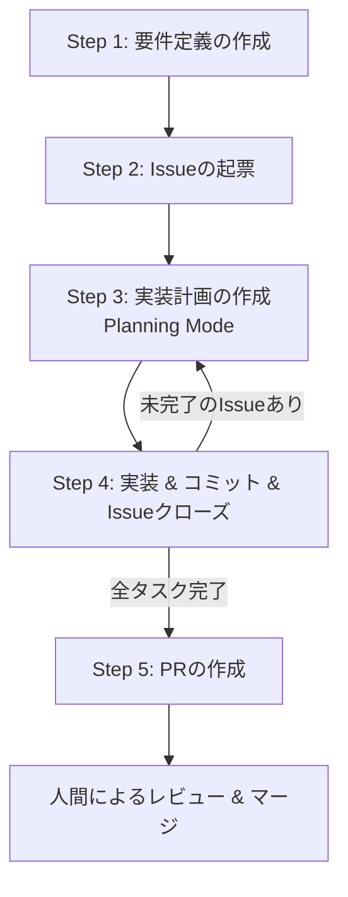

## はじめに

この記事では、**Google Antigravity**と**GitHub MCP (Model Context Protocol)** を組み合わせて、**Issue起票から実装、Pull Request (PR) 作成といった、開発における一つ一つのタスクを自動化する方法**を紹介します。

「仕様書を渡して、Issue切って実装してPR作って」

これら一つ一つの作業をエージェントに任せることで、人間はより本質的な「設計」や「レビュー」に集中できるようになります。そんな新しい開発体験を、今日から実践するための具体的な手順を解説します。

## 概要

GitHub MCPを導入したAntigravityを使えば、以下のようなやり取りだけで開発が完結します。



## 準備：環境を整える

まずは、AntigravityでGitHubを操作できるようにするために、**Github MCP (Model Context Protocol)** サーバーをセットアップします。

### 1. GitHub個人アクセストークン（PAT）の発行

GitHubの設定から、`repo` スコープを持つPATを発行しておきます。

### 2. GitHub MCPのインストール

Antigravityの設定（または `.agent/config` 等）で、GitHub MCPを追加します。
通常、以下のようなコマンドで動作します。

```bash
npx -y @modelcontextprotocol/server-github
```

:::message
**セキュリティの注意点**
トークンなどの機密情報は、直接コードに埋め込まず、環境変数やセキュアな設定ファイルで管理するようにしましょう。
:::

## 実践

環境が整ったら、実際に自動化を試してみましょう。
今回は例として、**「localStorageをDB代わりにした、App Router構成のマルチページCRUDノートアプリ」**を作成していきます。

### ステップ1：要件定義の作成

まずは作りたいアプリケーションのイメージを伝えて、要件定義書を作成してもらいます。

**プロンプト:**

> 「#SKILL.md localStorageをDB代わりにした、App Router構成のマルチページCRUDノートアプリを、モダンなデザインで一括作成したい。」
> （#SKILL.md を必ず使用するために指定しています。ドラッグアンドロップでチャットに追加できます。）

エージェントが要件を整理し、`requirements.md`として出力してくれます。


### ステップ2：Issueの起票

作成された要件定義を元に、GitHubにIssueを起票します。

**プロンプト:**

「#SKILL.md」（）

GitHub MCPが動作し、自動的にリポジトリにIssueが作成されます。


### ステップ3：実装計画の作成

ここからは、作成されたIssueを一つずつ消化していきます。
**重要**: 複雑な実装を行うため、Antigravityのモードを**Planning Mode**に切り替えてください。

**プロンプト:**

> 「#SKILL.md #1」(※ #1 は対象のIssue番号)\_

エージェントがコードベースを分析し、どのファイルをどう変更するかの計画（Plan）を提示します。


提示された計画を確認し、必要であればコメントで修正を指示します。問題なければ **Proceed** を押して実行させます。

### ステップ4：コミットとIssueクローズ

実装が完了したら、変更内容をコミットし、対応したIssueをクローズします。

**プロンプト:**

> 「#SKILL.md」（）


_Issueも自動的にクローズされます_

この「計画 → 実装 → コミット」の流れを、残りのサブタスク（Issue）が完了するまで繰り返します。

### ステップ5：PRの作成

全ての機能実装が完了したら、最後にPull Requestを作成します。

**プロンプト:**

> 「#SKILL.md」（）


これで、変更状況が一目でわかるPRが作成されました。あとは人間がコードレビューを行い、マージするだけです。

## 最後に

このアカウントでは、ただの「ツール紹介」ではなく、明日から開発フローを変えるための実践方法を共有していきます！
更新を見逃さないよう、ぜひ今のうちにZennのアカウントをフォローしてお待ちください！！！
