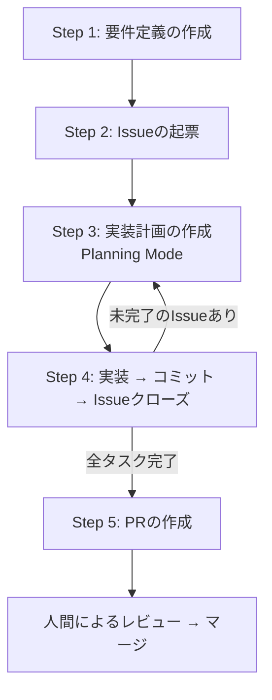

## はじめに

この記事では、**Google Antigravity**と**GitHub MCP (Model Context Protocol)** を組み合わせて、**Issue起票から実装、Pull Request (PR) 作成といった、開発における一つ一つのタスクを自動化する方法**を紹介します。

「仕様書を渡して、Issue切って実装してPR作って」

これら一つ一つの作業をエージェントに任せることで、人間はより本質的な「設計」や「レビュー」に集中できるようになります。そんな新しい開発体験を、今日から実践するための具体的な手順を解説します。

## 概要

GitHub MCPを導入したAntigravityを使えば、以下のようなやり取りだけで開発が完結します。



## 準備：環境を整える

まずは自動化に必要なスキルと環境をセットアップします。

### 1. SKILLをルートディレクトリに配置

この自動化フローの核となる「Skill」ファイル（エージェントへの指示書）を準備します。
以下のリポジトリクローンし、プロジェクトのルートディレクトリに.agent以下をコピーしてください。

https://github.com/tkr-krhr-1/antigravity_skills_implementation_template

### 2. GitHub個人アクセストークン（PAT）の発行

AntigravityからGitHubを操作（Issue起票やPR作成）するために、GitHubの権限を持ったトークンが必要です。

1. GitHubの **[Settings](https://github.com/settings/profile)** ページにアクセスします。
2. 左サイドバーの一番下にある **[Developer settings]** をクリックします。
3. **[Personal access tokens]** > **[Tokens (classic)]** を選択します。
   （※ Fine-grained tokensも利用可能ですが、設定が容易なClassicを今回は使用します）
4. **[Generate new token (classic)]** をクリックします。
5. **Note** に用途（例: `Antigravity MCP`）を入力し、**Expiration**（有効期限）を設定します。
6. **Select scopes** で、以下の権限にチェックを入れます。
   - `repo` （リポジトリの操作：**必須**）
   - `user` （ユーザー情報の取得：推奨）
7. **[Generate token]** をクリックし、表示されたトークン（`ghp_`から始まる文字列）をコピーして控えておきます。

:::message alert
トークンはこの画面で一度しか表示されません。必ずパスワード管理ツールなどに保存してください。
:::

### 3. GitHub MCPのインストール

Antigravityの設定ファイル（標準では `~/.antigravity/mcp_config.json` など）を開き、GitHub MCPサーバーを登録します。

以下のように `mcpServers` オブジェクト内に設定を追加してください。`env` ブロックで先ほど発行したトークンを指定します。

```json
{
  "mcpServers": {
    "github": {
      "command": "npx",
      "args": ["-y", "@modelcontextprotocol/server-github"],
      "env": {
        "GITHUB_PERSONAL_ACCESS_TOKEN": "ここに発行したPATを貼り付け"
      }
    }
  }
}
```

:::message alert
**セキュリティの注意**
設定ファイルに直接トークンを書き込む際は、このファイルを誤ってGitにコミットしないよう十分注意してください。
可能な限り、IDEのシークレット管理機能や環境変数参照機能を使用することを推奨します。
:::

### 4. GitHub CLIのインストール

スキル内で `gh` コマンドを使用するため、GitHub CLIをインストール・認証しておきます。

```bash
# macOS
brew install gh

# Windows
winget install --id GitHub.cli
```

インストール後、以下のコマンドでログインします（ブラウザ認証が立ち上がります）。

```bash
gh auth login
```

### 5. Next.jsのプロジェクトを構築

今回は土台としてNext.jsのApp Router環境を使用します。以下のコマンドで空のプロジェクトを作成してください。

```bash
npx create-next-app@latest my-app --typescript --tailwind --eslint
cd my-app
```

## 実践

環境が整ったら、実際に自動化を試してみましょう。
今回は例として、**「localStorageをDB代わりにした、App Router構成のマルチページCRUDノートアプリ」**を作成していきます。

### ステップ1：要件定義の作成

まずは作りたいアプリケーションのイメージを伝えて、要件定義書を作成してもらいます。

**プロンプト:**

> 「#SKILL.md localStorageをDB代わりにした、App Router構成のマルチページCRUDノートアプリを、モダンなデザインで一括作成したい。」（.agent/skills/requirement/SKILL.md）

「#SKILL.md」は必ず使用するために指定しています。ドラッグアンドロップでチャットに追加できます。


エージェントが要件を整理し、`requirements.md`として出力してくれます。


### ステップ2：Issueの起票

作成された要件定義を元に、GitHubにIssueを起票します。

**プロンプト:**

> 「#SKILL.md」（.agent/skills/issue/SKILL.md）

GitHub MCPが動作し、自動的にリポジトリにIssueが作成されます。


### ステップ3：実装計画の作成

ここからは、作成されたIssueを一つずつ消化していきます。
:::message alert
**重要**: 複雑な実装を行うため、Antigravityのモードを**Planning Mode**に切り替えてください。
:::

**プロンプト:**

> 「#SKILL.md #69」(.agentskills/implementation/SKILL.md)

エージェントがコードベースを分析し、どのファイルをどう変更するかの計画（Plan）を提示します。


提示された計画を確認し、必要であればコメントで修正を指示します。問題なければ **Proceed** を押して実行させます。

### ステップ4：コミットとIssueクローズ

実装が完了したら、変更内容をコミットし、対応したIssueをクローズします。

**プロンプト:**

> 「#SKILL.md」（.agent/skills/commit/SKILL.md）


_Issueも自動的にクローズされます_

この「計画 → 実装 → コミット」の流れを、残りのサブタスク（Issue）が完了するまで繰り返します。

### ステップ5：PRの作成

全ての機能実装が完了したら、最後にPull Requestを作成します。

**プロンプト:**

> 「#SKILL.md」（.agent/skills/pr/SKILL.md）


これで、変更状況が一目でわかるPRが作成されました。
あとは人間がコードレビューを行い、マージするだけです。

### 成果物

今回作成されたものはこちら。


## 最後に

このアカウントでは、ただの「ツール紹介」ではなく、明日から開発フローを変えるための実践方法を共有していきます！
更新を見逃さないよう、ぜひ今のうちにZennのアカウントをフォローしてお待ちください！！！
